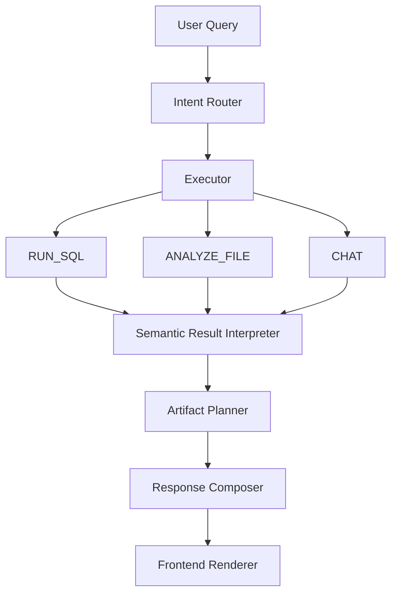

# Response Generation Architecture Guide

> **TL;DR:** You already have the hard part working: the backend is producing a structured plan, SQL, and result metadata. The gap is now the **response contract + rendering orchestration**, not SQL generation itself.

---

## 🎯 Core Philosophy

What you need is not "just better prompting."

You need a **response presentation architecture** with 3 separate layers:

### Three-Layer Architecture

1. **Execution Layer**
   - Decides: `CHAT` / `RUN_SQL` / `ANALYZE_FILE`

2. **Semantic Answer Layer**
   - Decides what the answer means
   - Examples: `single_value` / `table` / `chart` / `summary` / `comparison` / `timeline`

3. **UI Composition Layer**
   - Decides how to render it
   - Examples: `stat card` + `table` + `follow-up chips`

> ⚠️ **Key Insight:** Your current backend response is still too LLM-message-centric.  
> To behave more like ChatGPT, it must become **artifact-centric**.

---

## 1️⃣ What is Wrong in Your Current Response

### Current Query Example

```text
"How many customers are there in AP?"
```

### Current Backend Response

```json
{
  "message": "There are 10,000 customers in AP.",
  "sql": "...",
  "row_count": 1,
  "response_type": "message"
}
```

### ❌ Problems with This Approach

- ❌ Hides the actual returned data shape
- ❌ Does not expose a reusable display model
- ❌ UI cannot decide whether to show stat card / mini table / chart
- ❌ Treats everything as text instead of structured artifact

> **Golden Rule:** For a SQL/file analyzer, the backend should **always return structured renderable blocks**.

---

## 2️⃣ Correct Mental Model

### A. Backend Should Produce

- ✅ Answer text
- ✅ Data payload
- ✅ Presentation hints
- ✅ Clarification questions
- ✅ Suggested next actions

### B. Frontend Should Render

- ✅ KPI card
- ✅ Default table
- ✅ Optional chart
- ✅ Summary block
- ✅ Citations / source references
- ✅ Follow-up action chips

---

## 3️⃣ Golden Rule for Your Application

### For Structured Data

**Default output should be:**

- ✅ Brief natural language answer
- ✅ Table view
- ✅ Optional stat card if single metric
- ✅ Chart only if explicitly requested OR confidently inferable

### For Unstructured Data / File Analysis

**Default output should be:**

- ✅ Summary
- ✅ Key points / extracted entities / sections
- ✅ Quoted evidence snippets
- ✅ Interactive paragraph cards / expandable sections
- ✅ Table only if structured extraction exists

> 💡 **This is the exact behavior you described, and it is the right design.**

---

## 4️⃣ Response Contract You Should Implement

### Recommended Schema

```json
{
  "success": true,
  "response": {
    "id": "uuid",
    "mode": "RUN_SQL",
    "answer_type": "metric_with_table",
    "title": "Customers in AP",
    "summary": "There are 10,000 customers in AP.",
    "confidence": 0.95,

    "data": {
      "kind": "sql_result",
      "columns": [
        { 
          "name": "customer_count", 
          "type": "number", 
          "semantic_role": "metric" 
        }
      ],
      "rows": [
        { "customer_count": 10000 }
      ],
      "row_count": 1,
      "truncated": false
    },

    "presentation": {
      "primary_view": "stat",
      "secondary_views": ["table"],
      "default_table_visible": true,
      "chart_recommended": false,
      "chart_candidates": []
    },

    "artifacts": [
      {
        "type": "stat_card",
        "title": "Customer Count",
        "value": 10000,
        "subtitle": "State = AP"
      },
      {
        "type": "table",
        "title": "Result Table",
        "columns": ["customer_count"],
        "rows": [[10000]]
      }
    ],

    "clarifications": [],
    "suggested_questions": [
      "Would you like district-wise breakdown within AP?",
      "Would you like the full customer list instead of only the count?",
      "Would you like this as a bar chart?"
    ],

    "execution": {
      "sql": "SELECT COUNT(*) AS customer_count FROM genai.customers WHERE state = 'AP';",
      "sql_safe": true,
      "limit_applied": false,
      "execution_time_ms": 92
    }
  }
}
```

> ✅ **This schema is much closer to how a ChatGPT-like UI should consume backend output.**

---

## 5️⃣ Separate Answer Type from UI Type

### ⚠️ This is Critical

**❌ Do not use only:**

```python
response_type = "message"
```

**✅ Instead use:**

### Semantic Answer Types

- `single_metric`
- `metric_with_dimension`
- `tabular_result`
- `comparison`
- `trend`
- `distribution`
- `ranking`
- `detail_record`
- `document_summary`
- `document_qa`
- `entity_extraction`
- `mixed_analysis`

### UI Artifact Types

- `text`
- `stat_card`
- `table`
- `bar_chart`
- `line_chart`
- `pie_chart`
- `summary_card`
- `bullet_group`
- `evidence_snippets`
- `document_sections`
- `download_block`

> 💡 **Key Point:** The same query can map to multiple UI artifacts.

### Example Mapping

**Query:**
```text
"How many customers are there in AP?"
```

**Semantic Type:**
- `single_metric`

**Artifacts:**
- `stat_card`
- `table`
- `suggested_questions`

---

## 6️⃣ Default Rendering Rules You Should Implement

### A. RUN_SQL Rules

#### Case 1: Single Row + Single Numeric Column

**Example:**
```sql
COUNT(*), SUM(amount), AVG(balance)
```

**Render:**
- ✅ Primary = stat card
- ✅ Secondary = one-row table
- ✅ Show short sentence summary

---

#### Case 2: Multiple Rows + Few Columns

**Render:**
- ✅ Primary = table
- ✅ Optional chart recommendation if dimension + metric pattern detected

---

#### Case 3: Grouped by Time

**Example:**
```text
"Month-wise count"
```

**Render:**
- ✅ Primary = table
- ✅ Recommend line or bar chart
- ✅ If user asked "show chart", render chart too

---

#### Case 4: Grouped by Category

**Example:**
```text
"Status-wise distribution"
```

**Render:**
- ✅ Primary = table
- ✅ Recommend bar chart
- ✅ Pie only if number of categories is small and user explicitly asked

---

#### Case 5: Detailed Records

**Example:**
```text
"Show all customers in AP"
```

**Render:**
- ✅ Primary = table
- ✅ Natural language summary: *"Showing first 1000 records."*
- ✅ Ask:
  - "Would you like all records export?"
  - "Any filters?"
  - "Any visualization?"

---

### B. ANALYZE_FILE Rules

#### Case 1: Narrative PDF/Doc

**Render:**
- ✅ Summary block
- ✅ Key findings
- ✅ Entities / topics
- ✅ Evidence snippets
- ✅ Section navigation

---

#### Case 2: Tabular File (Excel/CSV)

**Render:**
- ✅ Table preview
- ✅ Schema summary
- ✅ Detected columns + types
- ✅ Optional auto-insights
- ✅ Chart only if query requests it or pattern is obvious

---

#### Case 3: Mixed File

**Render:**
- ✅ Summary first
- ✅ Extracted tables separately
- ✅ Evidence cards

---

### C. CHAT Rules

**Render:**
- ✅ Conversational answer
- ✅ Maybe code block / bullets / explanation cards
- ✅ No forced table unless relevant

---

## 7️⃣ The Orchestration Pipeline You Should Build



**Your pipeline should be:**

```
User Query
  ↓
Intent Router
  ↓
Executor
  ├── RUN_SQL
  ├── ANALYZE_FILE
  └── CHAT
  ↓
Semantic Result Interpreter
  ↓
Artifact Planner
  ↓
Response Composer
  ↓
Frontend Renderer
```

---

## 8️⃣ Add a Semantic Result Interpreter

> 🔥 **This is the missing piece in many GenAI apps.**

After SQL executes or file analysis finishes, run a **deterministic interpreter**.

### For SQL Results, Interpreter Should Inspect:

- Column count
- Row count
- Data types
- Semantic roles
- Whether one column is time-like
- Whether one column is categorical
- Whether one column is metric
- Whether result is suitable for charting

### Example Logic

```python
def infer_answer_type(columns, rows, user_requested_chart=False):
    row_count = len(rows)
    numeric_cols = [c for c in columns if c.semantic_role == "metric"]
    time_cols = [c for c in columns if c.semantic_role == "time"]
    category_cols = [c for c in columns if c.semantic_role == "category"]

    if row_count == 1 and len(numeric_cols) == 1:
        return "single_metric"
    elif has_time_column and has_numeric_column:
        return "trend"
    elif has_category_column and has_numeric_column:
        return "distribution"
    elif row_count > 1:
        return "tabular_result"
    else:
        return "textual_result"
```

> ⚠️ **Important:** This must be **deterministic**, not fully LLM-driven.

---

## 9️⃣ Add Semantic Column Roles

For each result column, infer roles like:

- `metric`
- `dimension`
- `time`
- `category`
- `identifier`
- `text`
- `currency`
- `percentage`

### Example

```json
{
  "columns": [
    { 
      "name": "month", 
      "type": "date", 
      "semantic_role": "time" 
    },
    { 
      "name": "status", 
      "type": "string", 
      "semantic_role": "category" 
    },
    { 
      "name": "count", 
      "type": "number", 
      "semantic_role": "metric" 
    }
  ]
}
```

> ✅ **Once you do this, the UI can automatically decide what to show.**

---

## 🔟 Clarification Engine Design

### User's Requirement

> *"If explicitly I ask for pie / bar graph I should get those visualization based on data but LLM should ask clarification questions if it needs info about x axis and y axis"*

✅ **Correct approach!**

But **do not ask clarification for every chart request.**

### ✅ No Clarification Needed When Chart Mapping is Obvious

**Example:**
```text
"Show customer count by month as bar chart"
```

- X = month
- Y = count
- ✅ **No need to ask**

---

### ❓ Ask Clarification When Ambiguous

**Example:**
```text
"Show this as chart"
```

**You should ask:**
- Which chart type do you want?
- Which field on X-axis?
- Which metric on Y-axis?

---

### ❓ Ask Clarification When Multiple Valid Mappings Exist

**Example:**  
Result has columns:

- `month`
- `district`
- `customer_count`
- `revenue`

**Then ask:**
- X-axis: `month` or `district`?
- Y-axis: `customer_count` or `revenue`?
- Chart type: `bar` or `line`?

---

### Return Structured Clarification

```json
{
  "clarifications": [
    {
      "type": "visualization_mapping",
      "message": "I found multiple valid chart configurations.",
      "questions": [
        {
          "key": "x_axis",
          "label": "Choose X-axis",
          "options": ["month", "district"]
        },
        {
          "key": "y_axis",
          "label": "Choose Y-axis",
          "options": ["customer_count", "revenue"]
        },
        {
          "key": "chart_type",
          "label": "Choose chart type",
          "options": ["bar", "line"]
        }
      ]
    }
  ]
}
```

> ✅ **This is much better than free-form text-only clarification.**

---

## 1️⃣1️⃣ Suggested Questions Engine

> 🔥 **This is also missing in your current response.**

For example, after:

```text
"There are 10,000 customers in AP"
```

You should return:

```json
{
  "suggested_questions": [
    "Would you like district-wise customer count in AP?",
    "Would you like the customer list from AP?",
    "Would you like this split by month for 2025?",
    "Would you like a bar chart?"
  ]
}
```

### These Are Not Random

Generate them from:

- ✅ Result semantics
- ✅ Available dimensions
- ✅ Table schema
- ✅ Previous user intent

> 💡 **This is how you get ChatGPT-like "question back" behavior.**

---

## 1️⃣2️⃣ Frontend Rendering Strategy

Your frontend should **not try to infer everything from raw SQL/message**.

It should **render based on artifacts**.

### Example React Rendering

```tsx
function ArtifactRenderer({ artifact }: { artifact: Artifact }) {
  switch (artifact.type) {
    case "stat_card":
      return <StatCard {...artifact} />;
    case "table":
      return <DataTable {...artifact} />;
    case "bar_chart":
      return <BarChart {...artifact} />;
    case "summary_block":
      return <SummaryBlock {...artifact} />;
    case "evidence_snippets":
      return <EvidenceList {...artifact} />;
    default:
      return null;
  }
}
```

> 💡 **So backend decides WHAT, frontend decides HOW.**

---

## 1️⃣3️⃣ What Your Response Should Look Like for Different Cases

### Example 1: Simple Count Query

**User:**
```text
"How many customers are there in AP?"
```

**Response:**
- ✅ Summary text
- ✅ Stat card
- ✅ 1-row table
- ✅ Suggested follow-ups

---

### Example 2: Grouped Data Query

**User:**
```text
"Get customer count month wise for 2025"
```

**Response:**
- ✅ Summary
- ✅ Table
- ✅ Optional bar/line recommendation
- ✅ Suggested question: *"Would you like status-wise split too?"*

**Example JSON:**

```json
{
  "answer_type": "trend",
  "artifacts": [
    {
      "type": "table",
      "title": "Customer Count by Month (2025)"
    },
    {
      "type": "bar_chart",
      "title": "Customer Count by Month",
      "x_axis": "month",
      "y_axis": "customer_count"
    }
  ]
}
```

**If chart not explicitly requested, you can either:**

- Return only table and `chart_recommended = true`, or
- Return both table and chart if confidence is high

**For your app, I recommend:**

- ✅ Table always
- ✅ Chart only if asked or obvious time-series/grouped result

---

### Example 3: File Summary Query

**User:**
```text
"Summarize this agreement PDF"
```

**Response:**
- ✅ Summary block
- ✅ Key clauses
- ✅ Parties
- ✅ Obligations
- ✅ Risks
- ✅ Evidence snippets with page refs

---

## 1️⃣4️⃣ Strong Recommendation: Never Return Only Message for Structured Data

For DB and spreadsheet/file structured outputs, **always include:**

```json
{
  "data": {
    "columns": [],
    "rows": []
  }
}
```

Even if there is only one value.

### Why?

- ✅ Keeps frontend generic
- ✅ Helps export/download
- ✅ Helps charts
- ✅ Helps debugging
- ✅ Helps follow-up queries

### ✅ Your Current Response Should Have Returned:

```json
{
  "data": {
    "columns": [
      { 
        "name": "count", 
        "type": "number", 
        "semantic_role": "metric" 
      }
    ],
    "rows": [
      { "count": 10000 }
    ]
  }
}
```

❌ **Not just a text message.**

---

## 1️⃣5️⃣ SQL Analyzer Response Standard You Should Adopt

Here is the practical standard I recommend.

### Top-Level Sections

- ✅ `summary`
- ✅ `data`
- ✅ `artifacts`
- ✅ `clarifications`
- ✅ `suggested_questions`
- ✅ `execution`
- ✅ `debug` (only in dev mode)

### Minimal Stable Version

```json
{
  "success": true,
  "response": {
    "id": "uuid",
    "mode": "RUN_SQL",
    "summary": "There are 10,000 customers in AP.",
    "answer_type": "single_metric",
    "data": {
      "columns": [
        { 
          "name": "customer_count", 
          "type": "number", 
          "semantic_role": "metric" 
        }
      ],
      "rows": [
        { "customer_count": 10000 }
      ],
      "row_count": 1
    },
    "artifacts": [
      {
        "type": "stat_card",
        "title": "Customer Count",
        "value": 10000
      },
      {
        "type": "table",
        "title": "Result",
        "columns": ["customer_count"],
        "rows": [[10000]]
      }
    ],
    "clarifications": [],
    "suggested_questions": [
      "Would you like district-wise breakup?",
      "Would you like the full list of customers?",
      "Would you like a chart?"
    ],
    "execution": {
      "sql": "SELECT COUNT(*) AS customer_count FROM genai.customers WHERE state = 'AP';"
    }
  }
}
```

---

## 1️⃣6️⃣ How to Make It Feel Like ChatGPT

ChatGPT feels good because it does these things well:

### A. It Gives a Direct Answer First

❌ Not just raw data.

---

### B. It Presents Structured Content in the Right Visual Form

✅ Table when tabular, prose when narrative.

---

### C. It Asks Smart Follow-Up Questions

✅ Only when ambiguity exists.

---

### D. It Separates Reasoning from Rendering

✅ The UI is not guessing from text.

---

### E. It Gives Interaction Affordances

- ✅ Expand
- ✅ Refine
- ✅ Visualize
- ✅ Export
- ✅ Compare

> 💡 **You should mimic that architecture, not just the wording style.**

---

## 1️⃣7️⃣ Your Exact Backend Change List

You should implement these **7 components:**

### 1. ResultShapeAnalyzer

**Input:**
- SQL/file raw output

**Output:**
- Semantic result type
- Column roles
- Chart suitability

---

### 2. ArtifactPlanner

Maps semantic type to artifacts:

- Stat card
- Table
- Chart
- Summary
- Evidence block

---

### 3. ClarificationPlanner

Only triggers when:

- User requested chart but mapping ambiguous
- Result too broad
- User asks "all records" and result huge
- Multiple valid interpretations

---

### 4. SuggestedQuestionGenerator

Uses schema + result semantics + prior context

---

### 5. StructuredResponseComposer

Creates final JSON contract

---

### 6. Frontend Artifact Renderer

Renders each artifact independently

---

### 7. Mode-Specific Presentation Policy

Different rules for:

- `RUN_SQL`
- `ANALYZE_FILE`
- `CHAT`

---

## 1️⃣8️⃣ Best Response Policy Table

| Mode | Default Primary Output | Secondary Output | Clarify When |
|------|----------------------|-----------------|-------------|
| **RUN_SQL** (single metric) | stat card + short answer | 1-row table | rarely |
| **RUN_SQL** (grouped result) | table | optional chart | chart mapping ambiguous |
| **RUN_SQL** (detail rows) | table | summary + export hint | too many rows / broad result |
| **ANALYZE_FILE** (narrative) | summary | key points + evidence | extraction ambiguous |
| **ANALYZE_FILE** (spreadsheet) | table preview | summary + insights | chart mapping ambiguous |
| **CHAT** | prose answer | code/example/list | missing domain context |

---

## 1️⃣9️⃣ One Important Improvement for Your Current SQL

### ❌ Your Sample SQL

```sql
SELECT COUNT(*)
FROM genai.customers
WHERE state = 'AP' LIMIT 1000;
```

For `COUNT(*)`, `LIMIT 1000` is **unnecessary and semantically odd**.

### ✅ Use This Instead

```sql
SELECT COUNT(*) AS customer_count
FROM genai.customers
WHERE state = 'AP';
```

> 💡 **Also always alias computed columns.**  
> That helps table rendering and chart mapping.

---

## 2️⃣0️⃣ My Recommended Final Architecture for You

```
User Query
  ↓
Intent Router
  ↓
Executor (SQL / File / Chat)
  ↓
Result Shape Analyzer
  ↓
Semantic Presentation Planner
  ↓
Artifact Planner
  ↓
Clarification / Suggested Question Planner
  ↓
Structured Response Composer
  ↓
Frontend Renderer
```

> ✅ **This is the architecture that will make your system feel much closer to ChatGPT.**

---

## 2️⃣1️⃣ Practical Answer to Your Question

### You Asked:

> *"How to format the response as like how chatgpt does"*

### Answer:

❌ **Do not return only `message + sql`.**

✅ **Return:**

- Summary text
- Structured data
- Artifact definitions
- Clarification questions
- Suggested follow-up questions
- Execution metadata

### And Apply These Defaults:

| Data Type | Default Output |
|-----------|---------------|
| **Structured DB output** | → Always show table, plus stat card if single metric |
| **Visualization requested** | → Render chart if mapping is clear |
| **Visualization ambiguous** | → Ask structured clarification |
| **Unstructured file output** | → Summary + evidence snippets + key sections |
| **Spreadsheet-like file output** | → Table first, summary second |

---

## 📦 Production-Ready Response Contract

Below is a production-ready response contract you can adopt for your GenAI app.

It covers all 3 modes:

- `RUN_SQL`
- `ANALYZE_FILE`
- `CHAT`

And it is designed so your frontend can render responses like a ChatGPT-style data/file/chat assistant, without guessing from plain text.

---

## 2️⃣2️⃣ Core Design Principle

Your backend should always return:

- ✅ What the answer says
- ✅ What data came back
- ✅ How it should be rendered
- ✅ What clarifications are needed
- ✅ What follow-up suggestions to show

So the response should be:

```
summary + data + artifacts + clarifications + suggestions + execution
```

❌ **Not just:**

```
message + sql
```

---

## 2️⃣3️⃣ Recommended Top-Level Response Schema

### Unified Response Envelope

```json
{
  "success": true,
  "response": {
    "id": "uuid",
    "mode": "RUN_SQL",
    "answer_type": "single_metric",
    "title": "Customers in AP",
    "summary": "There are 10,000 customers in AP.",
    "confidence": 0.95,

    "data": {
      "kind": "sql_result",
      "columns": [],
      "rows": [],
      "row_count": 0,
      "truncated": false,
      "total_available_rows": null
    },

    "artifacts": [],

    "clarifications": [],

    "suggested_questions": [],

    "execution": {
      "sql": null,
      "sources": [],
      "time_ms": null,
      "warnings": [],
      "safe": true
    },

    "debug": null
  },
  "timestamp": 1773204737602,
  "session_id": "session-uuid",
  "message_id": "message-uuid"
}
```

---

## 2️⃣4️⃣ Production-Ready Answer Types

These are **semantic answer types**.

```python
ANSWER_TYPES = [
    "single_metric",
    "metric_with_table",
    "tabular_result",
    "distribution",
    "trend",
    "ranking",
    "comparison",
    "detail_records",
    "document_summary",
    "document_qa",
    "entity_extraction",
    "mixed_analysis",
    "clarification_required",
    "chat_response",
    "error"
]
```

---

## 2️⃣5️⃣ Production-Ready Artifact Types

These are **UI renderable components**.

```python
ARTIFACT_TYPES = [
    "text_block",
    "stat_card",
    "table",
    "bar_chart",
    "line_chart",
    "pie_chart",
    "area_chart",
    "summary_block",
    "bullet_group",
    "key_value_list",
    "evidence_snippets",
    "document_sections",
    "insight_cards",
    "download_block",
    "warning_block",
    "code_block",
    "suggestion_chips"
]
```

---

## 2️⃣6️⃣ Exact FastAPI / Pydantic Models

Below is a solid backend schema.

### Enums

```python
from enum import Enum
from typing import Any, Dict, List, Optional, Literal, Union
from pydantic import BaseModel, Field


class Mode(str, Enum):
    RUN_SQL = "RUN_SQL"
    ANALYZE_FILE = "ANALYZE_FILE"
    CHAT = "CHAT"


class AnswerType(str, Enum):
    SINGLE_METRIC = "single_metric"
    METRIC_WITH_TABLE = "metric_with_table"
    TABULAR_RESULT = "tabular_result"
    DISTRIBUTION = "distribution"
    TREND = "trend"
    RANKING = "ranking"
    COMPARISON = "comparison"
    DETAIL_RECORDS = "detail_records"
    DOCUMENT_SUMMARY = "document_summary"
    DOCUMENT_QA = "document_qa"
    ENTITY_EXTRACTION = "entity_extraction"
    MIXED_ANALYSIS = "mixed_analysis"
    CLARIFICATION_REQUIRED = "clarification_required"
    CHAT_RESPONSE = "chat_response"
    ERROR = "error"


class ArtifactType(str, Enum):
    TEXT_BLOCK = "text_block"
    STAT_CARD = "stat_card"
    TABLE = "table"
    BAR_CHART = "bar_chart"
    LINE_CHART = "line_chart"
    PIE_CHART = "pie_chart"
    AREA_CHART = "area_chart"
    SUMMARY_BLOCK = "summary_block"
    BULLET_GROUP = "bullet_group"
    KEY_VALUE_LIST = "key_value_list"
    EVIDENCE_SNIPPETS = "evidence_snippets"
    DOCUMENT_SECTIONS = "document_sections"
    INSIGHT_CARDS = "insight_cards"
    DOWNLOAD_BLOCK = "download_block"
    WARNING_BLOCK = "warning_block"
    CODE_BLOCK = "code_block"
    SUGGESTION_CHIPS = "suggestion_chips"
```

---

### Data Models

```python
class ColumnMeta(BaseModel):
    name: str
    label: Optional[str] = None
    datatype: str
    semantic_role: Optional[str] = None   # metric, dimension, time, category, identifier, text, percentage, currency
    nullable: Optional[bool] = True
    format_hint: Optional[str] = None     # currency, percentage, integer, decimal, date, datetime


class DataPayload(BaseModel):
    kind: Literal["sql_result", "file_table", "document_extract", "chat_context", "none"]
    columns: List[ColumnMeta] = Field(default_factory=list)
    rows: List[Dict[str, Any]] = Field(default_factory=list)
    row_count: int = 0
    truncated: bool = False
    total_available_rows: Optional[int] = None
    preview_only: bool = False
```

---

### Artifact Models

```python
class BaseArtifact(BaseModel):
    id: str
    type: ArtifactType
    title: Optional[str] = None
    order: int = 0


class TextBlockArtifact(BaseArtifact):
    type: Literal[ArtifactType.TEXT_BLOCK]
    content: str


class StatCardArtifact(BaseArtifact):
    type: Literal[ArtifactType.STAT_CARD]
    value: Union[int, float, str]
    subtitle: Optional[str] = None
    unit: Optional[str] = None
    trend_value: Optional[float] = None
    trend_label: Optional[str] = None


class TableArtifact(BaseArtifact):
    type: Literal[ArtifactType.TABLE]
    columns: List[str]
    rows: List[List[Any]]
    pagination: Optional[Dict[str, Any]] = None
    sortable: bool = True
    filterable: bool = True
    exportable: bool = True


class ChartAxis(BaseModel):
    field: str
    label: Optional[str] = None
    datatype: Optional[str] = None


class ChartSeries(BaseModel):
    field: str
    label: Optional[str] = None
    aggregation: Optional[str] = None


class ChartArtifact(BaseArtifact):
    type: Literal[
        ArtifactType.BAR_CHART,
        ArtifactType.LINE_CHART,
        ArtifactType.PIE_CHART,
        ArtifactType.AREA_CHART
    ]
    x_axis: Optional[ChartAxis] = None
    y_axis: Optional[ChartAxis] = None
    series: List[ChartSeries] = Field(default_factory=list)
    stacked: bool = False
    horizontal: bool = False
    data_ref: Optional[str] = "response.data"


class SummaryBlockArtifact(BaseArtifact):
    type: Literal[ArtifactType.SUMMARY_BLOCK]
    summary: str
    key_points: List[str] = Field(default_factory=list)


class BulletGroupArtifact(BaseArtifact):
    type: Literal[ArtifactType.BULLET_GROUP]
    items: List[str]


class KeyValueItem(BaseModel):
    key: str
    value: Any


class KeyValueListArtifact(BaseArtifact):
    type: Literal[ArtifactType.KEY_VALUE_LIST]
    items: List[KeyValueItem]


class EvidenceSnippet(BaseModel):
    text: str
    source_name: Optional[str] = None
    page: Optional[int] = None
    section: Optional[str] = None
    confidence: Optional[float] = None


class EvidenceSnippetsArtifact(BaseArtifact):
    type: Literal[ArtifactType.EVIDENCE_SNIPPETS]
    snippets: List[EvidenceSnippet]


class DocumentSection(BaseModel):
    heading: str
    summary: str
    page_start: Optional[int] = None
    page_end: Optional[int] = None


class DocumentSectionsArtifact(BaseArtifact):
    type: Literal[ArtifactType.DOCUMENT_SECTIONS]
    sections: List[DocumentSection]


class InsightCard(BaseModel):
    title: str
    description: str
    severity: Optional[str] = None


class InsightCardsArtifact(BaseArtifact):
    type: Literal[ArtifactType.INSIGHT_CARDS]
    cards: List[InsightCard]


class DownloadBlockArtifact(BaseArtifact):
    type: Literal[ArtifactType.DOWNLOAD_BLOCK]
    files: List[Dict[str, str]]


class WarningBlockArtifact(BaseArtifact):
    type: Literal[ArtifactType.WARNING_BLOCK]
    message: str


class CodeBlockArtifact(BaseArtifact):
    type: Literal[ArtifactType.CODE_BLOCK]
    language: str
    code: str


class SuggestionChipsArtifact(BaseArtifact):
    type: Literal[ArtifactType.SUGGESTION_CHIPS]
    chips: List[str]


Artifact = Union[
    TextBlockArtifact,
    StatCardArtifact,
    TableArtifact,
    ChartArtifact,
    SummaryBlockArtifact,
    BulletGroupArtifact,
    KeyValueListArtifact,
    EvidenceSnippetsArtifact,
    DocumentSectionsArtifact,
    InsightCardsArtifact,
    DownloadBlockArtifact,
    WarningBlockArtifact,
    CodeBlockArtifact,
    SuggestionChipsArtifact,
]
```

---

### Clarification Models

```python
class ClarificationOption(BaseModel):
    label: str
    value: str


class ClarificationQuestion(BaseModel):
    key: str
    label: str
    input_type: Literal["select", "multi_select", "text", "boolean"]
    required: bool = True
    options: List[ClarificationOption] = Field(default_factory=list)


class ClarificationRequest(BaseModel):
    type: Literal[
        "visualization_mapping",
        "missing_filter",
        "ambiguous_metric",
        "ambiguous_dimension",
        "too_many_rows",
        "file_selection"
    ]
    message: str
    questions: List[ClarificationQuestion] = Field(default_factory=list)
```

---

### Execution Metadata

```python
class SourceRef(BaseModel):
    source_type: Literal["database", "file", "chat_context", "vector_store"]
    source_name: str
    identifier: Optional[str] = None


class ExecutionMeta(BaseModel):
    sql: Optional[str] = None
    sql_safe: Optional[bool] = True
    limit_applied: Optional[bool] = None
    execution_time_ms: Optional[int] = None
    sources: List[SourceRef] = Field(default_factory=list)
    warnings: List[str] = Field(default_factory=list)
    safe: bool = True
```

---

### Final Response Model

```python
class UnifiedAssistantResponse(BaseModel):
    id: str
    mode: Mode
    answer_type: AnswerType
    title: Optional[str] = None
    summary: str
    confidence: float = 0.0
    data: DataPayload
    artifacts: List[Artifact] = Field(default_factory=list)
    clarifications: List[ClarificationRequest] = Field(default_factory=list)
    suggested_questions: List[str] = Field(default_factory=list)
    execution: ExecutionMeta
    debug: Optional[Dict[str, Any]] = None


class APIResponseEnvelope(BaseModel):
    success: bool
    response: UnifiedAssistantResponse
    timestamp: int
    session_id: Optional[str] = None
    message_id: Optional[str] = None
```

---

## 2️⃣7️⃣ Exact Response Examples

### A. RUN_SQL — Single Metric

**Query:**
```text
"How many customers are there in AP?"
```

**Response:**

```json
{
  "success": true,
  "response": {
    "id": "resp_001",
    "mode": "RUN_SQL",
    "answer_type": "single_metric",
    "title": "Customers in AP",
    "summary": "There are 10,000 customers in AP.",
    "confidence": 0.95,
    "data": {
      "kind": "sql_result",
      "columns": [
        {
          "name": "customer_count",
          "label": "Customer Count",
          "datatype": "integer",
          "semantic_role": "metric",
          "nullable": false,
          "format_hint": "integer"
        }
      ],
      "rows": [
        {
          "customer_count": 10000
        }
      ],
      "row_count": 1,
      "truncated": false,
      "total_available_rows": 1,
      "preview_only": false
    },
    "artifacts": [
      {
        "id": "a1",
        "type": "stat_card",
        "title": "Customer Count",
        "order": 1,
        "value": 10000,
        "subtitle": "State = AP",
        "unit": null,
        "trend_value": null,
        "trend_label": null
      },
      {
        "id": "a2",
        "type": "table",
        "title": "Result Table",
        "order": 2,
        "columns": ["customer_count"],
        "rows": [[10000]],
        "pagination": null,
        "sortable": false,
        "filterable": false,
        "exportable": true
      },
      {
        "id": "a3",
        "type": "suggestion_chips",
        "title": "Next Actions",
        "order": 3,
        "chips": [
          "Show district-wise count in AP",
          "Show full customer list in AP",
          "Show this as a bar chart"
        ]
      }
    ],
    "clarifications": [],
    "suggested_questions": [
      "Would you like district-wise count in AP?",
      "Would you like the full customer list in AP?",
      "Would you like this as a chart?"
    ],
    "execution": {
      "sql": "SELECT COUNT(*) AS customer_count FROM genai.customers WHERE state = 'AP';",
      "sql_safe": true,
      "limit_applied": false,
      "execution_time_ms": 92,
      "sources": [
        {
          "source_type": "database",
          "source_name": "genai",
          "identifier": "customers"
        }
      ],
      "warnings": [],
      "safe": true
    },
    "debug": null
  },
  "timestamp": 1773204737602,
  "session_id": "9dbce9e3-5ea5-4c98-83c1-0da482294cc1",
  "message_id": null
}
```

---

### B. RUN_SQL — Month-wise Grouped Result

**Query:**
```text
"Get BRAG distribution status month wise for 2025"
```

**Response:**

```json
{
  "success": true,
  "response": {
    "id": "resp_002",
    "mode": "RUN_SQL",
    "answer_type": "distribution",
    "title": "BRAG Distribution Status by Month (2025)",
    "summary": "Here is the month-wise BRAG distribution status breakdown for 2025.",
    "confidence": 0.93,
    "data": {
      "kind": "sql_result",
      "columns": [
        { "name": "month", "label": "Month", "datatype": "string", "semantic_role": "time" },
        { "name": "status", "label": "Status", "datatype": "string", "semantic_role": "category" },
        { "name": "distribution_count", "label": "Distribution Count", "datatype": "integer", "semantic_role": "metric" }
      ],
      "rows": [
        { "month": "Jan", "status": "Completed", "distribution_count": 120 },
        { "month": "Jan", "status": "Pending", "distribution_count": 35 },
        { "month": "Feb", "status": "Completed", "distribution_count": 142 }
      ],
      "row_count": 3,
      "truncated": false,
      "total_available_rows": 3,
      "preview_only": false
    },
    "artifacts": [
      {
        "id": "a1",
        "type": "table",
        "title": "Month-wise Status Breakdown",
        "order": 1,
        "columns": ["month", "status", "distribution_count"],
        "rows": [
          ["Jan", "Completed", 120],
          ["Jan", "Pending", 35],
          ["Feb", "Completed", 142]
        ],
        "sortable": true,
        "filterable": true,
        "exportable": true
      }
    ],
    "clarifications": [],
    "suggested_questions": [
      "Would you like this as a stacked bar chart?",
      "Would you like totals month wise only?",
      "Would you like status percentage month wise?"
    ],
    "execution": {
      "sql": "SELECT month, status, COUNT(*) AS distribution_count FROM ...",
      "sql_safe": true,
      "limit_applied": false,
      "execution_time_ms": 130,
      "sources": [
        { "source_type": "database", "source_name": "genai", "identifier": "brag_distribution" }
      ],
      "warnings": [],
      "safe": true
    },
    "debug": null
  },
  "timestamp": 1773204737602,
  "session_id": "9dbce9e3-5ea5-4c98-83c1-0da482294cc1",
  "message_id": null
}
```

---

### C. RUN_SQL — Visualization Clarification Required

**Query:**
```text
"Show this as a chart"
```

**Response:**

```json
{
  "success": true,
  "response": {
    "id": "resp_003",
    "mode": "RUN_SQL",
    "answer_type": "clarification_required",
    "title": "Chart Configuration Needed",
    "summary": "I found multiple valid ways to visualize this result.",
    "confidence": 0.88,
    "data": {
      "kind": "sql_result",
      "columns": [
        { "name": "month", "datatype": "string", "semantic_role": "time" },
        { "name": "district", "datatype": "string", "semantic_role": "category" },
        { "name": "customer_count", "datatype": "integer", "semantic_role": "metric" },
        { "name": "revenue", "datatype": "decimal", "semantic_role": "metric" }
      ],
      "rows": [],
      "row_count": 0,
      "truncated": false,
      "total_available_rows": null,
      "preview_only": true
    },
    "artifacts": [],
    "clarifications": [
      {
        "type": "visualization_mapping",
        "message": "Please choose how you want the chart to be configured.",
        "questions": [
          {
            "key": "x_axis",
            "label": "Choose X-axis",
            "input_type": "select",
            "required": true,
            "options": [
              { "label": "Month", "value": "month" },
              { "label": "District", "value": "district" }
            ]
          },
          {
            "key": "y_axis",
            "label": "Choose Y-axis",
            "input_type": "select",
            "required": true,
            "options": [
              { "label": "Customer Count", "value": "customer_count" },
              { "label": "Revenue", "value": "revenue" }
            ]
          },
          {
            "key": "chart_type",
            "label": "Choose chart type",
            "input_type": "select",
            "required": true,
            "options": [
              { "label": "Bar Chart", "value": "bar_chart" },
              { "label": "Line Chart", "value": "line_chart" }
            ]
          }
        ]
      }
    ],
    "suggested_questions": [],
    "execution": {
      "sql": null,
      "sql_safe": true,
      "limit_applied": null,
      "execution_time_ms": 20,
      "sources": [],
      "warnings": [],
      "safe": true
    },
    "debug": null
  },
  "timestamp": 1773204737602
}
```

---

### D. ANALYZE_FILE — Summary Mode

**Query:**
```text
"Summarize this agreement PDF"
```

**Response:**

```json
{
  "success": true,
  "response": {
    "id": "resp_004",
    "mode": "ANALYZE_FILE",
    "answer_type": "document_summary",
    "title": "Agreement Summary",
    "summary": "This agreement defines the partnership structure, capital contribution, profit sharing, and exit terms.",
    "confidence": 0.94,
    "data": {
      "kind": "document_extract",
      "columns": [],
      "rows": [],
      "row_count": 0,
      "truncated": false,
      "total_available_rows": null,
      "preview_only": false
    },
    "artifacts": [
      {
        "id": "a1",
        "type": "summary_block",
        "title": "Executive Summary",
        "order": 1,
        "summary": "This document outlines the legal and financial terms of the partnership agreement.",
        "key_points": [
          "Parties and ownership shares are defined.",
          "Capital contribution terms are included.",
          "Profit and loss sharing rules are specified.",
          "Exit and dispute resolution clauses exist."
        ]
      },
      {
        "id": "a2",
        "type": "document_sections",
        "title": "Section Overview",
        "order": 2,
        "sections": [
          {
            "heading": "Parties",
            "summary": "Identifies the partners and legal parties to the agreement.",
            "page_start": 1,
            "page_end": 1
          },
          {
            "heading": "Capital Contribution",
            "summary": "Describes the amount and method of initial contribution.",
            "page_start": 2,
            "page_end": 2
          }
        ]
      },
      {
        "id": "a3",
        "type": "evidence_snippets",
        "title": "Evidence",
        "order": 3,
        "snippets": [
          {
            "text": "The profits and losses shall be shared equally between the partners.",
            "source_name": "agreement.pdf",
            "page": 3,
            "section": "Profit Sharing",
            "confidence": 0.97
          }
        ]
      }
    ],
    "clarifications": [],
    "suggested_questions": [
      "Would you like a clause-by-clause explanation?",
      "Would you like the risks highlighted?",
      "Would you like this rewritten in plain English?"
    ],
    "execution": {
      "sql": null,
      "sql_safe": true,
      "limit_applied": null,
      "execution_time_ms": 540,
      "sources": [
        {
          "source_type": "file",
          "source_name": "agreement.pdf",
          "identifier": "file_001"
        }
      ],
      "warnings": [],
      "safe": true
    },
    "debug": null
  },
  "timestamp": 1773204737602
}
```

---

### E. ANALYZE_FILE — Structured Excel/CSV File

**Query:**
```text
"Show student count by campus from this Excel file"
```

**Response:**

```json
{
  "success": true,
  "response": {
    "id": "resp_005",
    "mode": "ANALYZE_FILE",
    "answer_type": "tabular_result",
    "title": "Student Count by Campus",
    "summary": "Here is the student count grouped by campus from the uploaded file.",
    "confidence": 0.96,
    "data": {
      "kind": "file_table",
      "columns": [
        { "name": "campus", "datatype": "string", "semantic_role": "category" },
        { "name": "student_count", "datatype": "integer", "semantic_role": "metric" }
      ],
      "rows": [
        { "campus": "Campus A", "student_count": 1200 },
        { "campus": "Campus B", "student_count": 980 }
      ],
      "row_count": 2,
      "truncated": false,
      "total_available_rows": 2,
      "preview_only": false
    },
    "artifacts": [
      {
        "id": "a1",
        "type": "table",
        "title": "Student Count by Campus",
        "order": 1,
        "columns": ["campus", "student_count"],
        "rows": [
          ["Campus A", 1200],
          ["Campus B", 980]
        ],
        "sortable": true,
        "filterable": true,
        "exportable": true
      }
    ],
    "clarifications": [],
    "suggested_questions": [
      "Would you like this as a bar chart?",
      "Would you like total student count?",
      "Would you like class-wise breakdown?"
    ],
    "execution": {
      "sql": null,
      "sql_safe": true,
      "execution_time_ms": 180,
      "sources": [
        {
          "source_type": "file",
          "source_name": "students.xlsx",
          "identifier": "file_002"
        }
      ],
      "warnings": [],
      "safe": true
    },
    "debug": null
  },
  "timestamp": 1773204737602
}
```

---

### F. CHAT Response

**Query:**
```text
"What is the difference between clustered and stacked bar chart?"
```

**Response:**

```json
{
  "success": true,
  "response": {
    "id": "resp_006",
    "mode": "CHAT",
    "answer_type": "chat_response",
    "title": "Clustered vs Stacked Bar Chart",
    "summary": "A clustered bar chart compares categories side by side, while a stacked bar chart shows how sub-parts contribute to the whole.",
    "confidence": 0.97,
    "data": {
      "kind": "none",
      "columns": [],
      "rows": [],
      "row_count": 0,
      "truncated": false,
      "total_available_rows": null,
      "preview_only": false
    },
    "artifacts": [
      {
        "id": "a1",
        "type": "text_block",
        "title": "Explanation",
        "order": 1,
        "content": "Clustered bars are best for direct comparison across groups. Stacked bars are best when you want to show both total and composition."
      },
      {
        "id": "a2",
        "type": "bullet_group",
        "title": "When to Use",
        "order": 2,
        "items": [
          "Use clustered when comparing values between groups.",
          "Use stacked when showing composition of totals.",
          "Use 100% stacked when proportions matter more than totals."
        ]
      }
    ],
    "clarifications": [],
    "suggested_questions": [
      "Would you like examples with sample data?",
      "Would you like a table comparing all bar chart types?"
    ],
    "execution": {
      "sql": null,
      "sql_safe": true,
      "execution_time_ms": 45,
      "sources": [],
      "warnings": [],
      "safe": true
    },
    "debug": null
  },
  "timestamp": 1773204737602
}
```

---

## 2️⃣8️⃣ Backend Decision Rules You Should Implement

### A. Result Shape Analyzer

After SQL/file execution, inspect:

- Row count
- Column count
- Datatype
- Semantic role
- User visualization intent

#### Example Logic

```python
def infer_answer_type(columns, rows, user_requested_chart=False):
    row_count = len(rows)
    numeric_cols = [c for c in columns if c.semantic_role == "metric"]
    time_cols = [c for c in columns if c.semantic_role == "time"]
    category_cols = [c for c in columns if c.semantic_role == "category"]

    if row_count == 1 and len(numeric_cols) == 1:
        return "single_metric"

    if time_cols and numeric_cols:
        return "trend"

    if category_cols and numeric_cols:
        return "distribution"

    if row_count > 1:
        return "tabular_result"

    return "chat_response"
```

---

### B. Artifact Planning Rules

#### RUN_SQL

- Single numeric result → `stat_card` + `table`
- Grouped result → `table`
- Trend result + user asked chart → `table` + `line_chart`
- Category distribution + user asked chart → `table` + `bar_chart`
- Detailed records → `table` + `suggestion_chips`

---

#### ANALYZE_FILE

- Narrative doc → `summary_block` + `document_sections` + `evidence_snippets`
- Spreadsheet → `table`, maybe `stat_card`, maybe `chart`

---

#### CHAT

- `text_block` + `bullet_group` mostly

---

## 2️⃣9️⃣ Recommended UI Defaults

### Structured DB/File Data

**Always show:**
- ✅ Summary
- ✅ Table

**Additionally:**
- ✅ Stat card if single metric
- ✅ Chart if explicitly requested or strongly inferable

---

### Unstructured File Content

**Always show:**
- ✅ Summary
- ✅ Key points
- ✅ Evidence snippets
- ✅ Expandable sections

❌ **Do not force table unless true structured extraction exists.**

---

## 3️⃣0️⃣ React Frontend Rendering Contract

Your frontend should render by `artifact.type`.

### TypeScript Interfaces

```typescript
export type Mode = "RUN_SQL" | "ANALYZE_FILE" | "CHAT";

export type ArtifactType =
  | "text_block"
  | "stat_card"
  | "table"
  | "bar_chart"
  | "line_chart"
  | "pie_chart"
  | "area_chart"
  | "summary_block"
  | "bullet_group"
  | "key_value_list"
  | "evidence_snippets"
  | "document_sections"
  | "insight_cards"
  | "download_block"
  | "warning_block"
  | "code_block"
  | "suggestion_chips";

export interface ColumnMeta {
  name: string;
  label?: string;
  datatype: string;
  semantic_role?: string;
  nullable?: boolean;
  format_hint?: string;
}

export interface DataPayload {
  kind: "sql_result" | "file_table" | "document_extract" | "chat_context" | "none";
  columns: ColumnMeta[];
  rows: Record<string, any>[];
  row_count: number;
  truncated: boolean;
  total_available_rows?: number | null;
  preview_only?: boolean;
}

export interface BaseArtifact {
  id: string;
  type: ArtifactType;
  title?: string;
  order: number;
}

export interface StatCardArtifact extends BaseArtifact {
  type: "stat_card";
  value: string | number;
  subtitle?: string;
  unit?: string;
  trend_value?: number;
  trend_label?: string;
}

export interface TableArtifact extends BaseArtifact {
  type: "table";
  columns: string[];
  rows: any[][];
  sortable?: boolean;
  filterable?: boolean;
  exportable?: boolean;
}

export interface ChartArtifact extends BaseArtifact {
  type: "bar_chart" | "line_chart" | "pie_chart" | "area_chart";
  x_axis?: { field: string; label?: string; datatype?: string };
  y_axis?: { field: string; label?: string; datatype?: string };
  series?: { field: string; label?: string; aggregation?: string }[];
  stacked?: boolean;
  horizontal?: boolean;
  data_ref?: string;
}

export interface SummaryBlockArtifact extends BaseArtifact {
  type: "summary_block";
  summary: string;
  key_points: string[];
}

export interface TextBlockArtifact extends BaseArtifact {
  type: "text_block";
  content: string;
}

export interface BulletGroupArtifact extends BaseArtifact {
  type: "bullet_group";
  items: string[];
}

export interface SuggestionChipsArtifact extends BaseArtifact {
  type: "suggestion_chips";
  chips: string[];
}

export type Artifact =
  | StatCardArtifact
  | TableArtifact
  | ChartArtifact
  | SummaryBlockArtifact
  | TextBlockArtifact
  | BulletGroupArtifact
  | SuggestionChipsArtifact;

export interface UnifiedAssistantResponse {
  id: string;
  mode: Mode;
  answer_type: string;
  title?: string;
  summary: string;
  confidence: number;
  data: DataPayload;
  artifacts: Artifact[];
  clarifications: any[];
  suggested_questions: string[];
  execution: {
    sql?: string | null;
    sql_safe?: boolean;
    limit_applied?: boolean | null;
    execution_time_ms?: number | null;
    sources: any[];
    warnings: string[];
    safe: boolean;
  };
  debug?: Record<string, any> | null;
}
```

---

### Artifact Renderer

```tsx
function ArtifactRenderer({ artifact }: { artifact: Artifact }) {
  switch (artifact.type) {
    case "stat_card":
      return <StatCard artifact={artifact} />;
    case "table":
      return <ResultTable artifact={artifact} />;
    case "bar_chart":
    case "line_chart":
    case "pie_chart":
    case "area_chart":
      return <ChartRenderer artifact={artifact} />;
    case "summary_block":
      return <SummaryBlock artifact={artifact} />;
    case "text_block":
      return <TextBlock artifact={artifact} />;
    case "bullet_group":
      return <BulletGroup artifact={artifact} />;
    case "suggestion_chips":
      return <SuggestionChips artifact={artifact} />;
    default:
      return null;
  }
}
```

---

### Main Response Renderer

```tsx
function AssistantResponseView({ response }: { response: UnifiedAssistantResponse }) {
  const artifacts = [...response.artifacts].sort((a, b) => a.order - b.order);

  return (
    <div>
      <h3>{response.title}</h3>
      <p>{response.summary}</p>

      {artifacts.map((artifact) => (
        <ArtifactRenderer key={artifact.id} artifact={artifact} />
      ))}

      {response.clarifications?.length > 0 && (
        <ClarificationPanel clarifications={response.clarifications} />
      )}
    </div>
  );
}
```

---

## 3️⃣1️⃣ Suggested Question Engine

These should be **deterministic + LLM-assisted**.

### For Single Metric

- Show breakdown
- Show details
- Show chart
- Compare with previous period

---

### For Grouped Result

- Show percentage
- Show another grouping
- Chart it
- Export it

---

### For File Summary

- Explain section
- Highlight risks
- Rewrite in simple language
- Extract action items

---

### Example Implementation

```python
def generate_suggested_questions(mode, answer_type, columns):
    suggestions = []

    if mode == "RUN_SQL" and answer_type == "single_metric":
        suggestions.extend([
            "Would you like a detailed breakdown?",
            "Would you like the underlying records?",
            "Would you like this as a chart?"
        ])

    if mode == "RUN_SQL" and answer_type in ["distribution", "trend", "tabular_result"]:
        suggestions.extend([
            "Would you like this visualized?",
            "Would you like filters applied?",
            "Would you like this exported?"
        ])

    if mode == "ANALYZE_FILE":
        suggestions.extend([
            "Would you like key risks highlighted?",
            "Would you like this rewritten in plain English?",
            "Would you like clause-by-clause explanation?"
        ])

    return suggestions[:3]
```

---

## 3️⃣2️⃣ Important Backend Improvements for Your Current System

For your current payload, **change these immediately:**

### ❌ Current

```json
{
  "response_type": "message"
}
```

### ✅ Replace with

```json
{
  "answer_type": "single_metric"
}
```

---

### ❌ Current

```json
{
  "message": "There are 10,000 customers in AP."
}
```

### ✅ Replace with

```json
{
  "summary": "There are 10,000 customers in AP."
}
```

---

### ❌ Current

No `data.rows`

### ✅ Replace with

```json
{
  "data": {
    "kind": "sql_result",
    "columns": [
      { 
        "name": "customer_count", 
        "datatype": "integer", 
        "semantic_role": "metric" 
      }
    ],
    "rows": [
      { "customer_count": 10000 }
    ],
    "row_count": 1,
    "truncated": false
  }
}
```

---

### ❌ Current

No artifact definitions

### ✅ Replace with

```json
{
  "artifacts": [
    {
      "id": "a1",
      "type": "stat_card",
      "title": "Customer Count",
      "order": 1,
      "value": 10000,
      "subtitle": "State = AP"
    },
    {
      "id": "a2",
      "type": "table",
      "title": "Result Table",
      "order": 2,
      "columns": ["customer_count"],
      "rows": [[10000]]
    }
  ]
}
```

---

## 3️⃣3️⃣ Best Default Rules for Your App

This is **the most important policy table for your product**.

### RUN_SQL

- ✅ Always return `summary`
- ✅ Always return structured `data`
- ✅ Always return `table` for structured results
- ✅ Add `stat_card` for single metric
- ✅ Chart only if user asked or confidently inferable
- ✅ Ask clarification only when chart mapping is ambiguous

---

### ANALYZE_FILE

- ✅ Unstructured documents → `summary` + `sections` + `snippets`
- ✅ Structured files → `table` + `summary` + optional insights
- ✅ Chart only when requested or clearly appropriate

---

### CHAT

- ✅ Natural language first
- ✅ Structured artifacts only if useful

---

## 3️⃣4️⃣ Final Recommendation for Architecture

Implement these backend classes:

1. `ResultShapeAnalyzer`
2. `SemanticRoleInferer`
3. `ArtifactPlanner`
4. `ClarificationPlanner`
5. `SuggestedQuestionGenerator`
6. `UnifiedResponseComposer`

> ✅ **That will give you ChatGPT-like response behavior much more than prompt tuning alone.**

---

## 3️⃣5️⃣ What I Recommend You Implement First

Start in this order:

### Phase 1
- Unified response schema
- Summary
- Data
- Artifacts

---

### Phase 2
- Result shape analyzer
- Artifact planner

---

### Phase 3
- Clarification planner for visualization ambiguity

---

### Phase 4
- Suggested question generator

---

### Phase 5
- Frontend artifact renderer

---

## 3️⃣6️⃣ My Strongest Recommendation

For your product, the best UX rule is:

### Structured Data
✅ **Summary + stat/table first**

### Unstructured File Content
✅ **Summary + evidence first**

> 💡 **That is the closest practical behavior to ChatGPT for your use case.**

---

## 📝 Next Steps

If you want, I can provide:

✅ Exact Python service classes for `ResultShapeAnalyzer` and `ArtifactPlanner` so you can directly integrate them into your FastAPI backend.

---

*Document Version: 2.0*  
*Last Updated: [Current Date]*
